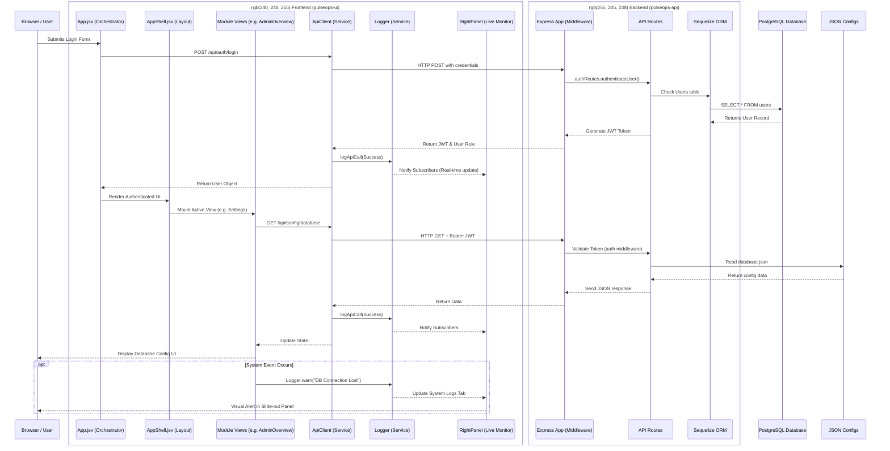

# PulseOps — System Architecture & Design Document

**Version:** 1.0  
**Stack:** React 18 + Vite 5 | Express + Sequelize ORM | PostgreSQL 16  

---

## 1. System Overview

PulseOps is a standalone enterprise operations platform composed of two independently deployable services:
- **pulseops-ui**: React 18 Single Page Application (Port 3000)
- **pulseops-api**: Express REST API backend (Port 4000)
- **Database**: PostgreSQL 16 (Port 5432)

### Key Architectural Principles
- **Unified Login**: Single login page for all users; roles are determined by backend JWT.
- **Role-Based Access Control (RBAC)**: Modules and UI elements are dynamically filtered based on the user's role.
- **Dual-Mode Authentication**: PostgreSQL as the primary auth provider, with a JSON file fallback (`defaultUsers.json`) if the DB is unavailable.
- **Externalized Configuration**: All UI text (`uiElementsText.json`), log messages (`logs.json`), and URLs (`urls.json`) are completely externalized.
- **Stateless Architecture**: Ready for Kubernetes horizontal scaling. JWTs are used instead of server-side sessions.

---

## 2. Component Interaction & Data Flow Diagram

The following Mermaid diagram illustrates how information flows from the browser through the React components, into the shared services, across the network to the Express API, and finally to the PostgreSQL database.

---

## 3. Frontend Architecture (pulseops-ui)

### App Orchestration
- **`main.jsx`**: Bootstraps the React application.
- **`App.jsx`**: Thin orchestrator managing authentication state. Listens for `auth:session-expired` events. Routes unauthenticated users to `LoginForm` and authenticated users to `PlatformDashboard`.
- **`AppShell.jsx`**: The master module-agnostic layout. Composes the `TopNav`, collapsible `SideNav`, main content area, and slide-out `RightPanel`.

### Module Registry (`moduleRegistry.js`)
Drives global navigation. Modules self-register their manifests (ID, name, icon, allowed roles). The registry filters modules so users only see what they have access to (e.g., `platform_admin` vs `shift_roster`).

### Design System (Shared Components)
All reusable UI elements reside in `@shared/components` to ensure visual consistency:
- **Card**: Container with visual variants (default, elevated, flat, glass).
- **Button**: Universal button with variants (primary, secondary, danger, etc.) and sizes.
- **Modals**: `ActionModal` for confirmations, `ProgressModal` for loading states.
- **EmptyState**, **LoadingSpinner**, **PageHeader**.
- **Layouts**: `TopNav`, `SideNav`, `RightPanel`, `ModuleLayout`.

### Services Layer
- **`ApiClient`**: Centralized HTTP client. Attaches JWT Bearer tokens to requests. Logs every request and response automatically via the Logger. Handles 401 Unauthorized by dispatching session expiry events.
- **`Logger`**: Structured frontend logging. Maintains separate circular buffers for System Logs and API Logs. Uses a subscriber pattern to update the UI (RightPanel, LogsViewer) in real-time.
- **`AuthService`**: Handles login/logout logic and token persistence.

---

## 4. Backend Architecture (pulseops-api)

### Request Lifecycle
1. **Middleware Chain**: `helmet` (security) → `cors` → `rate-limit` → `express.json` → `requestLogger` (Winston) → Route Handlers → `errorHandler`.
2. **Auth Middleware**: Verifies JWTs and enforces RBAC based on the route's required roles.

### API Routes
- **`/api/health`**: Public liveness and readiness probes (K8s ready).
- **`/api/auth`**: Login and current user profile (`/me`).
- **`/api/database`**: Admin routes for testing connections, syncing schema, loading default/demo data, and wiping the DB.
- **`/api/config`**: Admin routes for reading/updating system configurations (saved to JSON files).
- **`/api/users`**: CRUD operations for user management.
- **`/api/roster`**: Authenticated routes for shift roster schedules and configurations.

### Database Models (Sequelize ORM)
- **`User`**: UUID, name, email, bcrypt password, role (admin/manager/user), status.
- **`SystemConfig`**: Key-value pair configurations.
- **`RosterSchedule`**: Month/year specific schedule JSON payloads.
- **`RosterConfig`**: Active shifts, employees, and leave data.

---

## 5. Platform Admin Module

Orchestrated by `PlatformDashboard.jsx`, this module handles system management. It uses `AppShell` and provides the following views:
- **AdminOverview**: Health status tiles, database summary, and recent platform activity.
- **LogsViewer**: Comprehensive viewer for the Logger's system and API log buffers. Features level filtering, searching, and JSON payload inspection.
- **Users**: User management interface.
- **Settings**: A 4-tab inner navigation layout covering:
  - **Database Configuration**: Edit connection strings and test connectivity.
  - **Database Objects**: Initialize schema, seed default users, or wipe data.
  - **Authentication**: Switch between JSON fallback and Database auth.
  - **Logging**: Configure log retention, console output, and capture settings.

---

## 6. Shift Roster Module

A standalone application for workforce planning accessible to managers and admins:
- **RosterDashboard**: Interactive grid for viewing and editing monthly shift assignments.
- **RosterConfig**: Management of shift definitions, employee pools, and planned leaves.
- **RosterReports**: Utilization and compliance tracking.
- **RosterSettings**: Controls for loading demo data or clearing roster data.

---

## 7. Live Monitor (Right Panel)

A globally accessible slide-out panel (`RightPanel.jsx`) offering real-time observability:
- **System Logs Tab**: Live feed of frontend system events.
- **API Calls Tab**: Live feed of all network requests with status codes and latencies.
- **Report Issue Tab**: Form to submit bug reports, automatically attaching recent local logs.

---

## 8. Configuration & Data Flow

### Important Files
- **`@shared/config/urls.json`**: Base API URLs.
- **`@shared/config/logs.json`**: Central dictionary of all log messages to prevent string duplication.
- **`@shared/config/uiElementsText.json`**: Central dictionary of all UI labels, button text, and placeholders.
- **`@shared/config/messages.json`**: Dictionary for transient messages (errors, success toasts, confirm dialogs).
- **`@shared/config/app.json`**: App metadata and module definitions.
